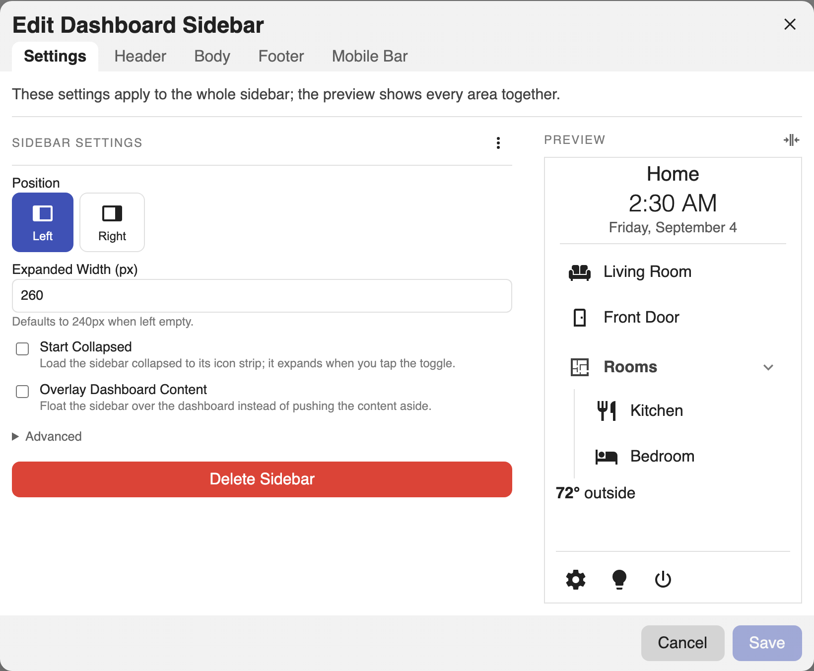
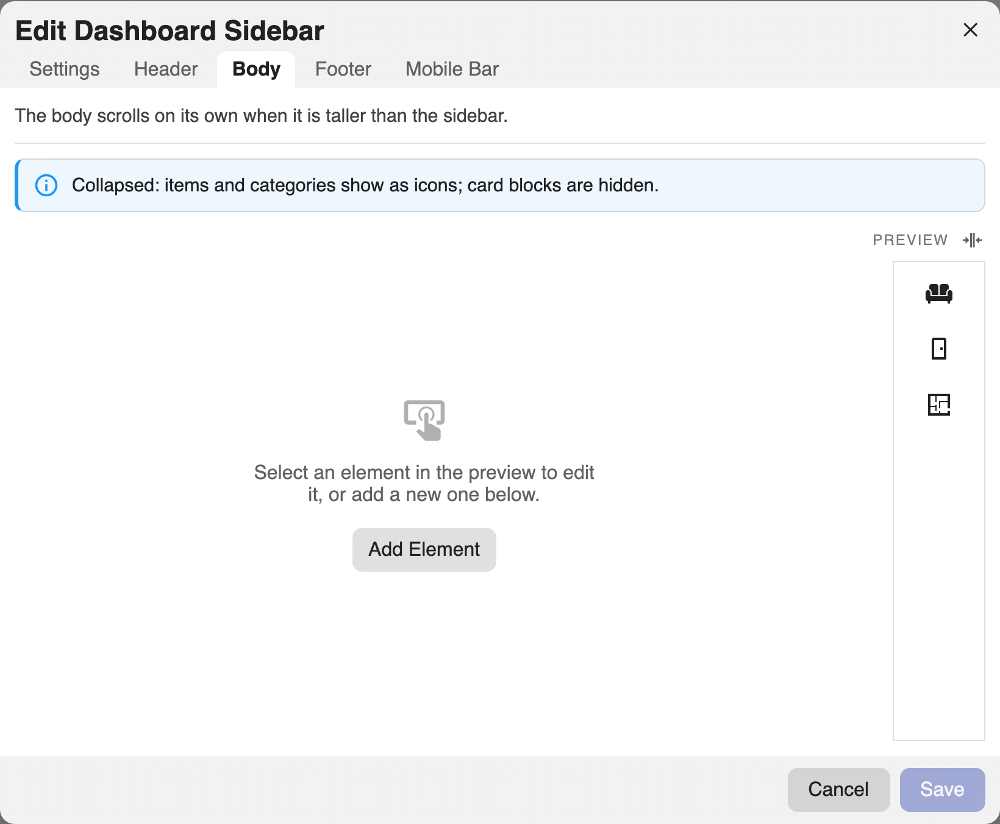

# Sidebar Settings

Sidebar-wide options live on the top level of the `dashboard_sidebar` config, and
in the editor's **Settings** tab.

!!! tip "Two ways to edit, one switch"
    Every how-to on this site has a **Visual editor** tab and a **YAML** tab
    showing the same change two ways. Pick one and the whole site follows you,
    on every page, until you switch back.

For the complete list of every field, its type, and whether it is required, see
the [Config Reference](reference.md) (generated from the source, always current).

## Sidebar-wide options

=== "Visual editor"

    Open the editor and go to the **Settings** tab. The main options are laid out
    as fields:

    - **Position**: which edge the sidebar docks to (left or right).
    - **Width**: the expanded width in pixels. Defaults to 240 when left empty.
    - **Start Collapsed**: load collapsed to the icon strip.
    - **Overlay Dashboard Content**: float the sidebar over the dashboard
      instead of pushing the content aside.

    Under **Settings → Advanced**:

    - **Mobile Breakpoint (px)**: the viewport width at and below which the
      mobile choices apply. Defaults to 768.
    - **On Desktop**: whether the sidebar shows on wide screens, or nothing does.
    - **On Mobile**: whether narrow screens get the sidebar, the
      [mobile bar](mobile.md), or nothing.
    - **Background**: any CSS background, including gradients.
    - The whole-sidebar [Card Mod](styling.md#card-mod).

    

=== "YAML"

    ```yaml
    dashboard_sidebar:
      position: right
      width: 300
      start_collapsed: false
      overlay: false
      on_desktop: sidebar
      on_mobile: bar
      breakpoint: 768
      background: linear-gradient(180deg, #1b2735, #090a0f)
      header: []
      body: []
      footer: {}
    ```

| Option | Type | Default | Description |
| --- | --- | --- | --- |
| `position` | `left` \| `right` | `left` | Which edge the sidebar docks to. |
| `width` | number (px) | `240` | Expanded width. |
| `start_collapsed` | boolean | `false` | Load collapsed to the icon strip. |
| `overlay` | boolean | `false` | Float over the dashboard instead of pushing the content aside. |
| `on_desktop` | `sidebar` \| `hidden` | `sidebar` | What renders on wide (desktop) viewports. |
| `on_mobile` | `sidebar` \| `bar` \| `hidden` | `sidebar` | What renders on narrow (mobile) viewports. Defaults to `bar` when a `mobile` section exists. |
| `breakpoint` | number (px) | `768` | Viewport width at and below which "mobile" applies. |
| `background` | CSS `background` | theme card bg | Any CSS background, including gradients. |
| `header` | list | - | Blocks pinned to the top. |
| `body` | list | - | Blocks in the scrolling region. |
| `footer` | mapping | - | The bottom bar (see [Footer](footer.md)). |
| `card_mod` | mapping | - | card-mod styling for the whole sidebar (see [Styling](styling.md)). |

## Push or overlay

By default the sidebar **pushes**: the dashboard view sits beside it and narrows
by the sidebar's width, so nothing is ever covered. Set `overlay: true` and the
sidebar **floats** over the view instead, which keeps the dashboard at full
width at the cost of hiding whatever is underneath the sidebar. Collapsing works
the same either way, so an overlay sidebar that starts collapsed covers only the
icon strip until you expand it.

```yaml
dashboard_sidebar:
  overlay: true
  start_collapsed: true
```

An overlay sidebar draws a drop shadow so its edge reads against the content.
Restyle or remove it with `--dashboard-sidebar-overlay-shadow` (see
[Styling](styling.md#theme-variables)).

## Collapsing

The sidebar can collapse to a slim **icon strip** using the toggle on its edge;
the choice is remembered per browser. While collapsed:

- **Titles** and **Text** blocks are hidden.
- **Items** and **categories** show as icons (or their
  [abbreviation](elements.md#item) when they have no icon); hovering shows a
  tooltip, and a category opens a popover of its items.
- **Footer buttons** collapse into a single **⋯** menu.

The editor's **Preview** has its own collapse toggle so you can check the icon
strip while building:



## Regions

- **Header**: pinned to the top, never scrolls.
- **Body**: scrolls on its own when taller than the sidebar.
- **Footer**: pinned to the bottom, never scrolls.

Each region holds an ordered list of [elements](elements.md).

=== "Visual editor"

    The **Header**, **Body**, and **Footer** tabs each edit the config key they
    are named for. Add an element with the **+** button, drag to reorder, and
    select any element to edit it.

=== "YAML"

    ```yaml
    dashboard_sidebar:
      header:
        - type: title
          text: Home
      body:
        - type: item
          title: Living Room
          tap_action: { action: navigate, navigation_path: /lovelace/living }
      footer:
        buttons:
          - icon: mdi:cog
            tap_action: { action: navigate, navigation_path: /config }
    ```
