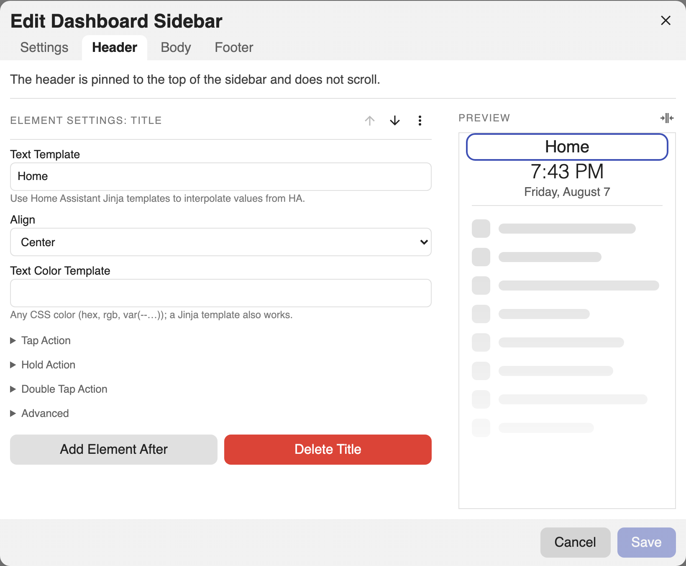
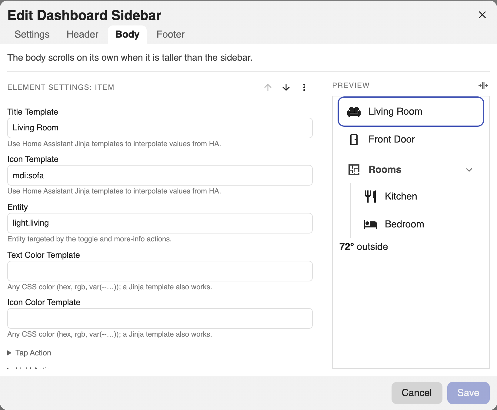
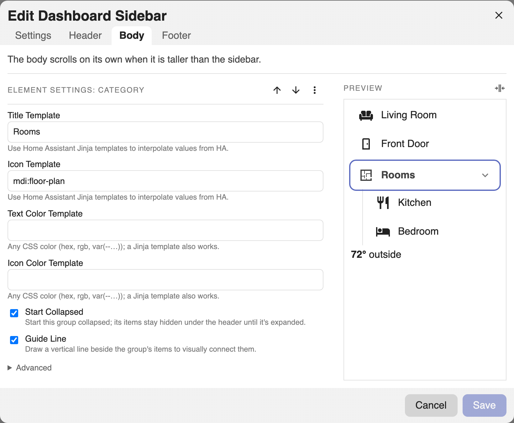
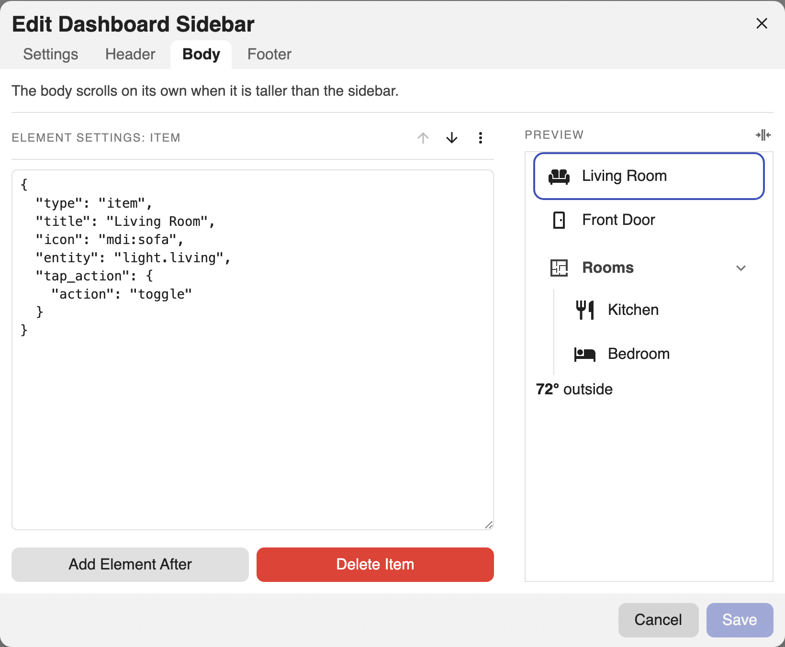

# Elements

Header and body regions hold an ordered list of elements. Each has a `type`.
Common options live under each element's **Advanced** section in the editor: an
**Abbreviation** (the short glyph shown for an item or category when the sidebar
is collapsed and it has no icon) and **Card Mod** (advanced CSS styling, see
[Styling](styling.md)). A `class` hook is also available in YAML; see
[Styling](styling.md#css-class).

!!! tip "Two ways to edit"
    Each element below has a **Visual editor** tab and a **YAML** tab for the same
    result. In the editor, pick a region tab (**Header** or **Body**), press
    **+**, choose the element type, then fill in its fields.

See the [Config Reference](reference.md) for every field on every element.

## Templating

- **Title, item titles, icons, and color fields** resolve to plain text, so only
  **Jinja** applies (not markdown), e.g. `{{ states('sensor.temp') }}`.
- **Markdown blocks** and the **markdown footer** render through Home Assistant's
  markdown card, so they support **markdown and Jinja**.

!!! warning "Current user"
    Home Assistant's server-side templates do not reliably expose the current
    user, so `{{ user }}` renders empty. The starter greeting bakes your name in
    at creation instead.

## Title

A heading of templatable text. Hidden while collapsed.

=== "Visual editor"

    Add a **Title** element. Set **Text** (templatable) and **Alignment**. An
    optional **Text Color** lives under **Advanced**.

    

=== "YAML"

    ```yaml
    - type: title
      text: Living Room
      align: center       # left | center | right
      text_color: '{{ "tomato" if is_state("alarm.x","triggered") else "" }}'
    ```

## Clock

A digital clock.

=== "Visual editor"

    Add a **Clock** element and pick a **Format** preset (`2:30 PM`, `14:30`,
    `2:30:39 PM`, `14:30:39`). A custom strftime pattern and a **Timezone** live
    under **Advanced → Custom Format**.

=== "YAML"

    ```yaml
    - type: clock
      format: '%H:%M'     # preset or any strftime pattern; empty = 24h
      timezone: America/New_York   # optional; empty = system zone
      align: center
      text_color: var(--primary-color)
    ```

## Date

A date block.

=== "Visual editor"

    Add a **Date** element. The **Format** dropdown offers curated regional presets
    (ISO, US month-first, day-first, dotted European, plus short/long/full
    variants). A custom pattern and **Timezone** live under **Advanced**.

=== "YAML"

    ```yaml
    - type: date
      format: '%A, %B %-d'   # preset or strftime; empty = locale default
      timezone: America/New_York
      align: center
      text_color: '#8ab4f8'
    ```

## Divider

A horizontal rule.

=== "Visual editor"

    Add a **Divider** element. An optional **Color** for the line lives under
    **Advanced**.

=== "YAML"

    ```yaml
    - type: divider
      color: var(--divider-color)   # optional line color; templatable
    ```

## Item

A tappable row. Standalone in a region, or nested in a category.

=== "Visual editor"

    Add an **Item**. Set **Title**, **Icon**, and an **Entity** (the target for
    toggle / more-info). Configure **Tap**, **Hold**, and **Double Tap** in their
    own sections (see [Actions](actions.md)). **Text/Icon Color**, an
    **Abbreviation** (the collapsed glyph when there is no icon), and **Card Mod**
    live under **Advanced**.

    

=== "YAML"

    ```yaml
    - type: item
      title: Front Door
      icon: mdi:door                # templatable; falls back to initials/abbr collapsed
      entity: lock.front_door       # target for toggle / more-info
      text_color: '{{ "green" if is_state("lock.front_door","locked") else "red" }}'
      icon_color: var(--primary-color)
      tap_action:
        action: toggle
      # hold_action, double_tap_action — see Actions
      # Advanced: abbr (collapsed glyph when no icon), card_mod
    ```

See **[Actions](actions.md)** for tap/hold/double-tap and the active-page
highlight.

## Category

A collapsible group of items, nested one level deep.

=== "Visual editor"

    Add a **Category**. Set its **Title** and **Icon**, then add child **Items**
    inside it. **Start Collapsed** and **Guide Line** (the vertical guide beside
    the items) are toggles on the category. Categories cannot nest further.

    

=== "YAML"

    ```yaml
    - type: category
      title: Rooms
      icon: mdi:floor-plan
      text_color: coral
      icon_color: navy
      start_collapsed: true   # default true
      guide_line: true        # vertical guide beside the items; default true
      items:
        - title: Kitchen
          tap_action: { action: navigate, navigation_path: /lovelace/kitchen }
        - title: Bedroom
          tap_action: { action: navigate, navigation_path: /lovelace/bedroom }
    ```

Collapsed, a category becomes an icon that opens a popover of its items.

## Markdown

Markdown with Jinja, rendered by Home Assistant's markdown card. Hidden while
collapsed. (`type: markdown`.)

=== "Visual editor"

    Add a **Markdown** element and write **Content** (markdown + Jinja). Set
    **Alignment**; **Text Color** lives under **Advanced**.

=== "YAML"

    ```yaml
    - type: markdown
      content: |
        **{{ states("sensor.temperature") }}°** outside
      align: left
      text_color: var(--secondary-text-color)
    ```

## Card

Any Lovelace card, authored as YAML. Fills the sidebar width; keeps its own card
chrome. Validated live against Home Assistant's card registry. (`type: card`.)

=== "Visual editor"

    Add a **Card** element and paste any Lovelace card config into its YAML field.
    It is validated live against Home Assistant's card registry.

=== "YAML"

    ```yaml
    - type: card
      card:
        type: gauge
        entity: sensor.cpu
        # card_mod: { style: 'ha-card { padding: 8px }' }   # size/style via the card itself
    ```

## Editing an element as YAML

Every element can be edited as YAML without leaving the visual editor: select it,
open the **⋯** menu, and choose **Edit As YAML**. This is handy for pasting a
config, or for fields the form does not expose. Choose **Edit With UI** to switch
back.


