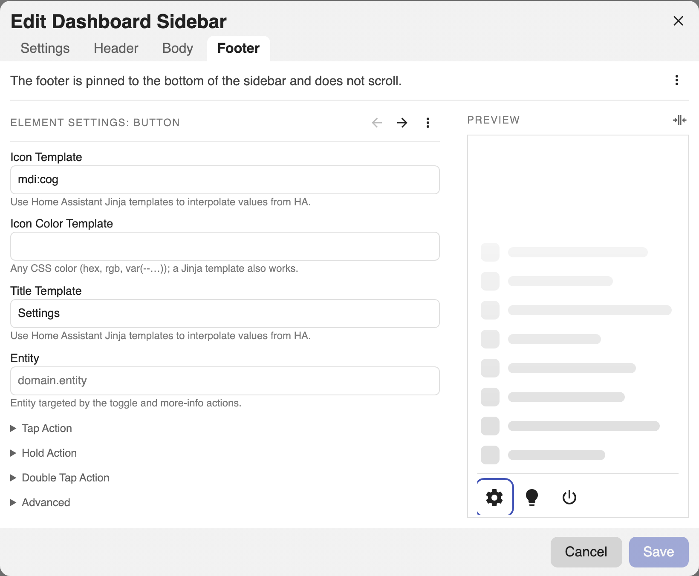

# Footer

The footer is pinned to the bottom of the sidebar and never scrolls. It has
**exactly one** of three modes — a **Button Row**, a **Card**, or a
**Markdown** block — plus an optional top divider bar.

=== "Visual editor"

    Switch modes in the editor's **Footer** tab via the **⋯** menu → **Change to**.
    The **⋯** menu also toggles the top divider and flips this tab between UI and
    YAML editing.

=== "YAML"

    The mode is chosen by which key you set under `footer`: `buttons`, `card`, or
    `markdown`. Set `divider: false` to hide the top divider bar.

## Button Row

A row of icon buttons. When they don't all fit, the overflow collapses into a
vertical **⋯** menu (in both expanded and collapsed views).

=== "Visual editor"

    In the **Footer** tab (Button Row mode), press **+** to add a button. Each
    button takes an **Icon**, an optional **Entity**, a **Title** (tooltip), and
    its own **Tap/Hold/Double Tap** actions. **Icon Color** and **Card Mod** live
    under **Advanced**. Drag to reorder.

    

=== "YAML"

    ```yaml
    footer:
      divider: true          # show the top divider bar; default true
      buttons:
        - icon: mdi:lightbulb
          icon_color: '{{ "#ffb74d" if is_state("light.kitchen","on") else "grey" }}'
          title: Kitchen      # tooltip / accessible label; templatable
          entity: light.kitchen
          tap_action:
            action: toggle
        - icon: mdi:cog
          tap_action:
            action: navigate
            navigation_path: /config/dashboard
    ```

Each button supports the same [actions](actions.md), an `icon_color` template,
and an **Advanced** section (`card_mod`). Collapsed, the whole row becomes a
single **⋯** menu.

## Card

Any Lovelace card, full width.

=== "Visual editor"

    In the **Footer** tab, use **⋯** → **Change to → Card**, then paste any
    Lovelace card config.

=== "YAML"

    ```yaml
    footer:
      divider: true
      card:
        type: entities
        entities:
          - light.kitchen
    ```

## Markdown

Markdown with Jinja.

=== "Visual editor"

    In the **Footer** tab, use **⋯** → **Change to → Markdown**, then write the
    markdown. A **Text Color** and **Tap/Hold/Double Tap** actions are available so
    the footer can act as a link or toggle.

=== "YAML"

    ```yaml
    footer:
      divider: false
      markdown: '**{{ states("sensor.power") }} W** right now'
      markdown_color: var(--secondary-text-color)
      # tap_action / hold_action / double_tap_action also supported
    ```

The markdown footer can carry [tap/hold/double-tap actions](actions.md), so it
can act as a link or toggle.
