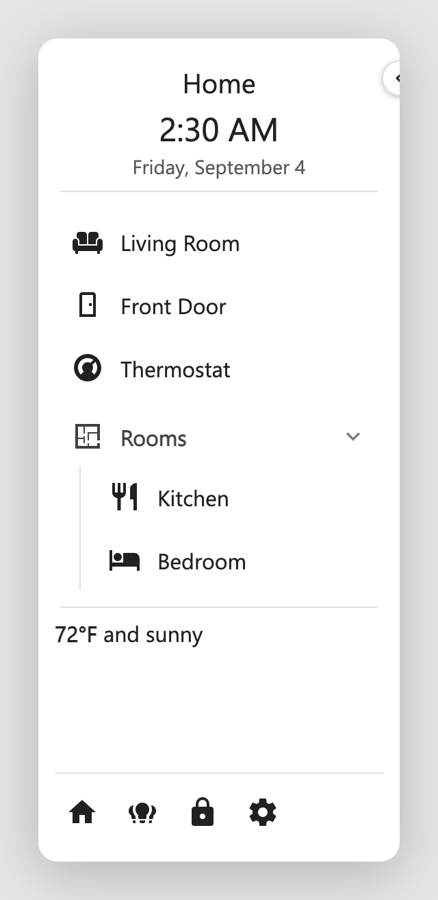
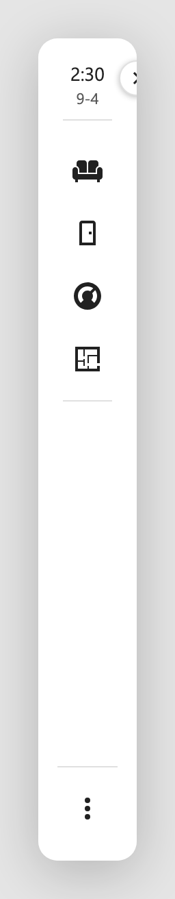

# Dashboard Sidebar

A configurable sidebar for Home Assistant Lovelace dashboards. It docks to the
left or right of a dashboard view, pushes the view aside (rather than floating
over it), and is edited **in place** through a visual editor, with no YAML needed,
though everything it produces is plain YAML under a `dashboard_sidebar` key.

## What it looks like

<div style="display:flex; gap:24px; align-items:flex-end; flex-wrap:wrap; margin:1em 0">
  <figure style="margin:0; text-align:center">
    
    <figcaption>Expanded</figcaption>
  </figure>
  <figure style="margin:0; text-align:center">
    
    <figcaption>Collapsed</figcaption>
  </figure>
</div>

!!! tip "These docs show every task two ways"
    Each how-to has a **Visual editor** tab and a **YAML** tab. Pick one with the
    toggle on any example and the whole site follows you, on every page.

## Highlights

- **Three regions**: a pinned **header**, a scrolling **body**, and a pinned
  **footer**.
- **Rich elements**: title, clock, date, divider, tappable items, collapsible
  categories, a **Markdown** block (markdown + Jinja), and **Cards** (any
  Lovelace card).
- **Collapsible**: the whole sidebar collapses to a slim icon strip; items and
  categories fall back to icons, with hover popovers.
- **Actions**: tap, hold, and double-tap actions on interactive elements
  (toggle, more-info, navigate, URL, call-service), with an active-page
  highlight for navigation links.
- **Templating**: Jinja in text, icon, and color fields; full markdown +
  Jinja in Markdown blocks.
- **Styling**: per-element text/icon colors, a sidebar background, and
  [card-mod](https://github.com/thomasloven/lovelace-card-mod) at the whole
  sidebar and per-element level.
- **Visual editor**: a four-tab modal (Settings, Header, Body, Footer) with
  a live preview that mirrors the real sidebar, drag-to-reorder, and per-tab
  YAML editing. Each tab is named for the config key it edits.

## Requirements

- **Home Assistant 2024.1** or newer.
- A **Lovelace dashboard** you can edit (any dashboard type). The sidebar is
  configured per dashboard.
- **[HACS](https://hacs.xyz/)** to download the card. HACS is a separate, one-time
  add-on; if you do not have it yet, install it first (or add the card as a manual
  resource). See [Install & Add](install.md).
- **[card-mod](https://github.com/thomasloven/lovelace-card-mod)** is
  **optional**, only needed for the advanced CSS styling in
  [Styling](styling.md). Everything else works without it.

## At a glance

```yaml
dashboard_sidebar:
  position: left
  header:
    - type: clock
      align: center
    - type: date
      align: center
    - type: title
      text: Hello Sam
      align: center
  body:
    - type: item
      title: Home
      icon: mdi:home
      tap_action:
        action: navigate
        navigation_path: /lovelace/home
  footer:
    buttons:
      - icon: mdi:lightbulb
        entity: light.kitchen
        tap_action:
          action: toggle
```

Head to **[Install & Add](install.md)** to get it onto a dashboard.
