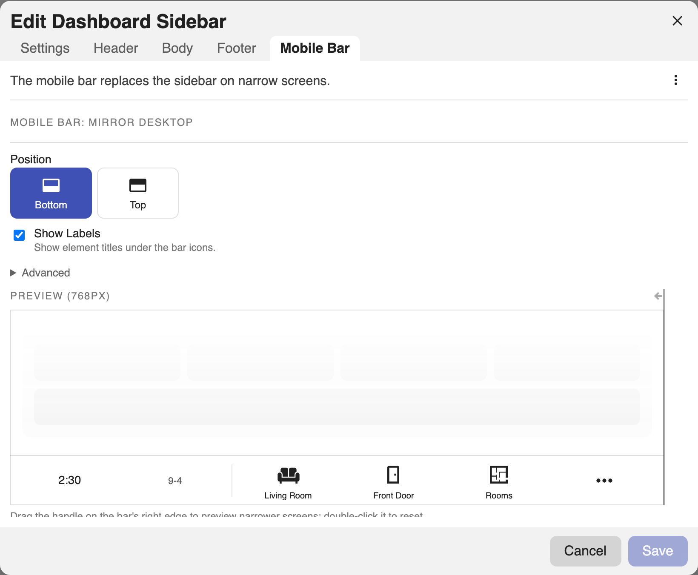
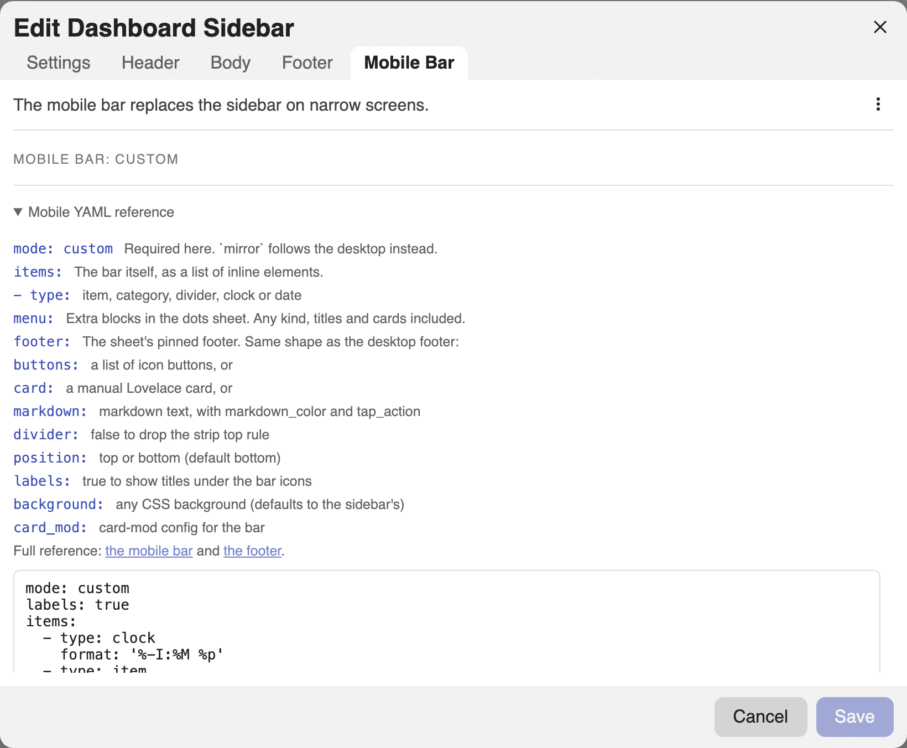

# Mobile Bar

On narrow screens the sidebar can be replaced by a bar pinned to the bottom (or
top) of the screen. Elements that don't fit fold into a **⋯** sheet that slides
up, along with the footer and any extra entries you curate.

The bar only exists when `on_mobile` is `bar`. Adding a `mobile:` section turns
it on by default; see [Sidebar Settings](configuration.md) for `on_mobile`,
`on_desktop`, and the `breakpoint` that decides what counts as narrow.

## Two modes

The bar gets its content one of two ways, chosen by `mode`:

| Mode | What the bar shows |
| --- | --- |
| `mirror` (default) | The desktop nav, in document order, and the desktop footer. |
| `custom` | Only what you spell out under `mobile`. It inherits nothing. |

=== "Visual editor"

    Open the **Mobile Bar** tab. The **⋯** menu switches between
    **Mirror Desktop** and **Custom Bar**. Switching to custom asks whether to
    **Copy Desktop Bar** (clone what the mirror shows, footer included) or
    **Start Empty**.

    Mirror mode shows the bar's options as a form. Custom mode is edited as
    YAML, with a collapsed **Mobile YAML reference** above the editor listing
    every key and linking here.

    

=== "YAML"

    ```yaml
    mobile:
      mode: mirror        # mirror | custom; default mirror
      position: bottom    # top | bottom; default bottom
      labels: false       # show element titles under the bar icons
    ```

`items`, `menu`, and `footer` belong to custom mode. Setting any of them
without `mode: custom` is an error rather than a silent no-op, because a
mirrored bar follows the desktop and carries nothing of its own.

## Mirror mode

The default. The bar shows the items, categories, dividers, clocks, and dates
from the desktop `header` and `body`, in order, and the desktop `footer` rides
behind the **⋯** sheet. Nothing else is configurable per element: change the
desktop and the bar follows.

Only the presentation options apply here.

```yaml
mobile:
  position: bottom
  labels: true
  background: 'linear-gradient(180deg, #1b2735, #090a0f)'
```

## Custom mode

The mobile section becomes the whole bar. Nothing is inherited, which is why
**Copy Desktop Bar** exists: it seeds `items` and `footer` from what the mirror
would have shown, so the switch is lossless.

=== "Visual editor"

    Custom mode is YAML-only. The preview beside it is live but read-only:
    tapping the **⋯** slot still opens the sheet so you can see the folded
    entries, but elements are not selected or dragged there.

    

=== "YAML"

    ```yaml
    mobile:
      mode: custom
      labels: true
      items:                      # the bar itself, in order
        - type: clock
        - type: item
          title: Overview
          icon: mdi:view-dashboard
          tap_action:
            action: navigate
            navigation_path: /lovelace/0
        - type: category           # categories open a flyout above their slot
          title: Rooms
          icon: mdi:sofa
          items:
            - title: Kitchen
              icon: mdi:silverware-fork-knife
              tap_action:
                action: navigate
                navigation_path: /lovelace/kitchen
      menu:                        # extra entries inside the ⋯ sheet
        - type: title
          text: Elsewhere
        - type: markdown
          content: '**{{ states("sensor.power") }} W** right now'
      footer:                      # the sheet's pinned footer
        buttons:
          - icon: mdi:lock
            tap_action:
              action: toggle
              entity: lock.front_door
    ```

`items` accepts `item`, `category`, `divider`, `clock`, and `date`. Leave it
out entirely for a bar that lives only behind the **⋯** sheet.

`menu` accepts any block kind, including titles, markdown, and cards, and
renders inside the sheet between the folded slots and the footer.

## The sheet footer

`mobile.footer` takes the **same shape as the desktop [footer](footer.md)**: a
button strip, a card, or markdown, with the same `divider` and markdown
options.

```yaml
mobile:
  mode: custom
  footer:
    divider: true
    buttons:
      - icon: mdi:cog
        tap_action:
          action: navigate
          navigation_path: /config/dashboard
    # or card: { type: entities, entities: [light.kitchen] }
    # or markdown: '**Good evening**'
```

In mirror mode the desktop footer is used and `mobile.footer` is rejected. In
custom mode the bar has no footer at all unless you set this, since a custom
bar inherits nothing.

## Options

```yaml
mobile:
  position: bottom     # top | bottom; which edge the bar docks to
  labels: false        # show element titles under the bar icons
  background: ''       # any CSS background; defaults to the sidebar's
  card_mod: {}         # card-mod config for the bar itself
```

These apply in both modes. Every part of the bar carries a
`dashboard-sidebar-bar-*` class for [card-mod](styling.md#card-mod) targeting,
and elements keep their own `class` and `id` hooks.

The full field list is in the [config reference](reference.md#mobileconfig).
